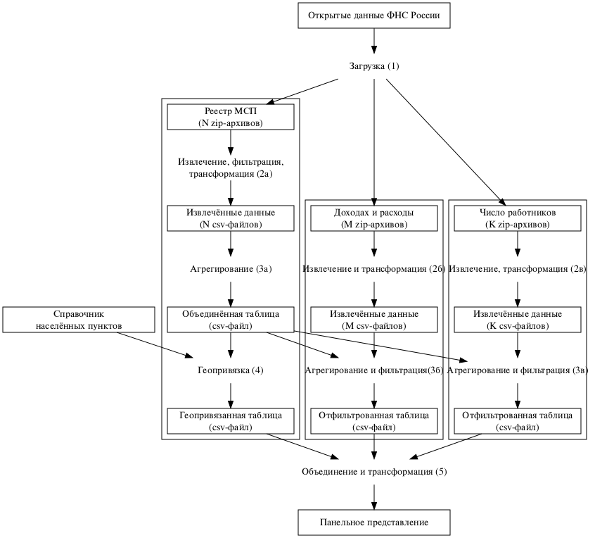

---
output:
  odt_document:
    number_sections: true
    reference_odt: "assets/reference.odt"
bibliography: "assets/biblio_ru.bib"
csl: "assets/citations.csl"
---

```{r setup, include=FALSE}
knitr::opts_chunk$set(
  warning = FALSE, 
  message = FALSE, 
  echo = FALSE, 
  fig.width = 6.5, 
  fig.height = 5)
options(knitr.kable.NA = "—")
```

```{r imports, cache = TRUE, include = FALSE}
source("Plots.R")
source("StatsHelper.R")
source("Diagram.R")
```

УДК 911.3, 519.688

**Использование открытых данных ФНС России для создания геопривязанного набора данных о субъектах малого и среднего предпринимательства в России**

Сёмин Павел Олегович

Пермский государственный национальный исследовательский университет, Россия, Пермский край, г. Пермь, ул. Букирева, 15, 614068

Сёмин Павел Олегович: ntsp\@ya.ru, ORCID 0000-0002-4015-9206

Контактное лицо:  
- Сёмин Павел Олегович  
- Телефон +7 9222 06 77 01  
- Email: ntsp\@ya.ru  
- Адрес: Россия, 622002, Свердловская обл., г. Нижний Тагил, ул. Космонавтов, д. 35, кв. 62

# Аннотация {-}

В статье представлена технология (алгоритм, приложение), которая создаёт геопривязанный табличный набор данных о субъектах малого и среднего предпринимательства (МСП) в России на основе открытых данных Федеральной налоговой службы (ФНС России). Получаемый набор данных охватывает период с 2016 по 2023 гг. и всю территорию России. Он представляет собой полный список (генеральную совокупность) субъектов МСП и содержит информацию о категории, имени или наименовании, месте жительства или местонахождении, виде деятельности, доходах, расходах и численности работников организации или индивидуального предпринимателя. В пространственном отношении набор детализирован до населённых пунктов с указанием географических координат и кода ОКТМО; во временном отношении — до месяца или года в зависимости от характеристики (признака субъекта МСП); в отношении вида деятельности — до конкретных кодов ОКВЭД. В отличие от классической data paper, статья содержит не описание данных как таковых, а рассказывает о методике их получения и демонстрацию одного из возможных результатов применения технологии. Используя описанный алгоритм и его предложенную реализацию на языке Python, исследователь может самостоятельно обработать исходные данные и получить актуальную версию набора данных, адаптированную для его задач. Алгоритм оптимизирован так, чтобы для его выполнения было достаточно компьютера средней конфигурации, несмотря на большой (около 2 Тб) объём исходных данных. Создаваемый с помощью алгоритма набор данных может применяться как непосредственно для пространственного анализа МСП в России, так как и в качестве  относительно репрезентативного источника сведений об экономике России в разрезе конкретных организаций, выступая как открытая и бесплатная альтернатива коммерческим системам наподобие Spark и Контур.Фокус. Кроме того, благодаря координатам он может без дополнительной обработки использоваться для картографирования, а наличие кодов ОКТМО позволяет объединять его с официальными статистическими сведениями.

**Ключевые слова:** открытые данные, пространственный анализ, геоданные, административные данные, малое и среднее предпринимательство, реестр организаций, набор данных, big data, Apache Spark, ФНС России

# 1. Введение

Современные общественно-географические исследования часто опираются на работу с данными. Некоторые специалисты используют на агрегированную экономическую и демографическую статистику. Так, О. Л. Виноградова, анализируя изменение интенсивности земледелия в Европе, опирается на показатели стран в разные годы [@Виноградова2020]; Т. А. Балина с соавторам, рассматривая воспрос о территориях опережающего социально-экономического развития, приводит подсчёты по субъектам Российской Федерации [@Балина2021]; Г. М. Лаппо, описывая свою концепцию разнообразия городов, опирается на сведения о числе жителей в населённых пунктах в разные периоды времени [@Лаппо2019]. Другие исследователи используют большие массивы дезагрегированных данных, собирая их вручную в общедоступных источниках и используя сложные методы их обработки. Например, А. И. и М. В. Красновы для своей работы, посвящённой трансформации сети расселения в Псковской области, собирали публичные сведения о местоположении пользователей социальной сети «ВКонтакте» и открытые данные о поисковых запросах к «Яндексу» [@Красновы2020]. Есть работы, опирающиеся на обобщённую статистику, но использующие продвинутые методы её анализа. В частности, А. В. Федорченко взял данные Международной организации автопроизводителей, рассчитал на их основе индексы и дополнил их картографической визуализацией, что позволило эффективно проанализировать территориальные сдвиги в мировой автомобильной промышленности [@Федорченко2017]. «Большие данные» также проникают в общественно-географическую науку, что отметили ещё десять лет назад М. Грэм и Т. Шелтон [@Graham2013]. Недавний пример такого рода исследований — работа Вэй Лю и Вэньцзэ У, которые используют сведения о пользователях социальной сети WeChat для изучения связей между типом землепользования и деятельностью людей [@Liu2020]. Таким образом, общая тенденция такова: для исследований используются данные, хотя объём, тип, качество этих данных и технологии их обработки отличаются. 

Прежде чем использовать данные, необходимо их получить. Поиск качественных данных в достаточном количестве и их предварительная обработка во многом определяют результативность научной деятельности: проблемы в данных или в их анализе приводят к неправильным выводам, а сделать исследование при нехватке данных зачастую невозможно. Следовательно, источники данных и информационные технологии — это важный прикладной аспект общественной географии как науки. В. Н. Лаженцев, например, отмечает, что «совершенствование статистической науки в значительной мере предопределяет уровень экономико-географических исследований» [@Лаженцев2015], а К. Брунсдон рассуждает о важности изложения точных деталей анализа данных в контексте воспроизводимости географических исследований [@Brunsdon2016]. Практическая важность данных для исследований подтверждается, в частности, различными инициативами, связанными с обеспечением доступа к таким данным. Так, П. Арцбергер с соавторами ещё 20 лет назад предложили следующий принцип: результаты исследований, финансируемых на публичном уровне, должны быть максимально общедоступными, поскольку это, в частности, способствует новым исследованиям и тем самым увеличивает научный потенциал и отдачу от инвестиций в науку [@Arzberger2006], а Д. Кард с коллегами указывают на важность доступа учёных к административным данным, то есть информации, которая накапливается органами исполнительной власти при осуществлении их функций [@Card2010]. Для географических исследований особую роль играет такая разновидность данных, как пространственные данные, обеспечение доступа к которым в недавние годы также вызывает интерес во многих странах, включая США, Великобританию, государства ЕС, Сингапур [@Jozefowicz2020].

В статье предложена технология (алгоритм), позволяющая формировать геопривязанный табличный набор данных о малых и средних фирмах в России. В качестве основы используется реестр субъектов малого и среднего предпринимательства (реестр МСП), размещённый в форме открытых данных на сайте Федеральной налоговой службы России (ФНС России). Набор данных охватывает всю территорию России, все виды экономической деятельности и период с середины 2016 г. по настоящее время. Его пространственное разрешение — до конкретного населённого пункта, временное — до месяца, структурное — до конкретного кода по общероссийскому классификатору видов экономической деятельности (ОКВЭД). Сведения являются дезагрегированными, то есть детализированными до уровня отдельных фирм (организаций и индивидуальных предпринимателей). Помимо структурированных адресов, набор содержит географические координаты и коды муниципальных образований. В отношении субъектов малого и среднего предпринимательства (МСП) набор данных представляет собой генеральную совокупность. Кроме того, в статье обосновывается, что указанный набор данных может использоваться как достаточно репрезентативная выборка для анализа экономики в целом, а не только малого и среднего предпринимательства.

Статья, помимо введения, включает в себя несколько разделов. В обзоре литературы приводится краткая информация об использовании различных источников данных в общественно-географических исследованиях и через это обосновывается необходимость в предложенной технологии. Раздел «Исходные данные» содержит описание первичных наборов данных, которые задействуются в технологии, а раздел «Методика обработки данных» излагает саму технологию. В разделе «Тестирование технологии» описываются и визуализируются процесс и результаты опробования технологии в отношении сведений о фирмах, ведущих деятельность в сфере сельского и лесного хозяйства, охоты и рыболовства. Раздел «Возможность генерализации результатов» посвящён оценке репрезентативности полученного набора данных применительно к экономике России в целом. В «Обсуждении» затрагиваются ключевые спорные моменты касательно предложенной технологии. «Выводы» подводят итоги работы.

# 2. Обзор литературы: источники данных в общественной географии

Типичным источником данных для исследований общественной географии России являются ресурсы Федеральной службы государственной статитстики (Росстата). К ним относятся, в частности, размещённые на официальном сайте этого органа данные официальной статистики, переписей и статистических обследований, база данных показателей муниципальных образований (БДМО) и единая межведомственная информационно-статистическая система (ЕМИСС). О. В. Кузнецова при исследовании структуры экономики российских регионов использует статистику валового регионального продукта и объёма отгруженных товаров [@Кузнецова2018]; Г. М. Фёдоров в своём анализе экономики регионов России на Балтике опирается на данные Росстата и Федеральной таможенной службы [@Fedorov2022]; С. Г. Сафронов изучает третичный сектор экономики России на базе данных Eurostat, Росстата и Федеральной налоговой службы [@Сафронов2021]; Ю. В. Петров на базе региональной, муниципальной статистики и данных иных органов власти формулирует предложения по социально-экономическому развитию юга Тюменской области [@Petrov2021]; М. А. Саранча оценивает развитие гостиничного и ресторанного бизнеса, задействуя результаты сплошного наблюдения Росстата за малым и среднем предпринимательством [@Sarancha2014]. Данные Росстата также используются для создания производных наборов данных, как в работе И. Ю. Пекер [@Peker2022]. Таким образом, большинство общественно-географических исследований не обходятся без применения данных Росстата как единственного источника информации или как одного из источников. 

Тем не менее, в ряде случаев данных Росстата недостаточно. Как следствие, возникает необходимость в альтернативных источниках информации, которые либо дополняют официальную статистику, либо заменяют её. Причины этого бывают разные. В некоторых случаях альтернативные источники информации используются для проверки или корректировки данных Росстата. Например, Р. А. Бабкин, основываясь на данных сотовых операторов, доказывает, что официальная численность населения московской агломерации занижена примерно на 10% из-за погрешности и инертности статистического учёта и «двудомности» значительной части москвичей [@Babkin2020]. Другая, более частая причина — отсутствие нужных сведений. Например, К. В. Ростислав, анализируя влияние местоположения на прибыльность предприятий, учитывает только организации с численностью работников меньше 250 человек и для проверки этого условия использует открытые данные ФНС России, так как Росстат такие сведения не предоставляет [@Rostislav2021]. С. С. Лачининский с соавторами оценивает спрол городских территорий Санкт-Петербурга с опорой на спутниковые снимки Landsat, так как на базе сведений официальной статистики провести необходимые подсчёты невозможно [@Lachininsky2023]. К преимуществам альтернативных источников данных относят повышенную точность и своевременность [@Воробьев2021], более высокое пространственное и временное разрешение [@Бабкин2021], возможность точного и детального анализа на микроуровне [@Бочкарёв2017], отмечая при этом несвоевременность, неполноту и потенциальную недостоверность официальной статистики [@Кузьминов2021]. Альтернативные источники данных дают доступ к генеральной совокупности, вследствие чего «отпадает необходимость в использовании выборочных, агрегированных и косвенных» источников сведений [@Блануца2017]. При использовании методов машинного обучения, что также становится актуальным в современной географии, важны объём выборки, дезагрегированность, количество признаков в данных, что также побуждает обращаться к альтернативным источникам [@Ростислав2020]. Таким образом, хотя традиционные статистические сведения по-прежнему важны в общественно-географических исследованиях, а порой незаменимы, есть нарастающая потребность в других информационных ресурсах. Запрос со стороны исследователей идёт на повышение объёма, оперативности предоставления, точности, пространственного и временного разрешения, расширение набора доступных показателей, а также на возможность валидации статистических сведений. Он проявляется и в части традиционных научных методов, так и методов, связанных с машинным обучением, хотя более актуален именно для последних, наиболее чувствительных к объёму данных, их дезагрегированности, детализации, удобным форматам представления.

Одним из альтернативных источников информации для географов-обществоведов являются административные данные Федеральной налоговой службы России (ФНС России). Они публикуются на официальном сайте этого органа власти или связанных с ним ресурсах. В географических работах используются, в частности, сведения о доходах физических лиц [@Petrov2021], о налоговых поступлениях в разрезе субъектов федерации или видов экономической деятельности [@Ростислав2020; @Сафронов2021], о среднесписочной численности работников организаций [@Rostislav2021], о количестве учтённых жилых помещений [@Lachininsky2021], о количестве малых и средних предприятий и мерах их поддержки [@Гуменюк2022]. Внимание исследователей к данным, публикуемым ФНС России, связано, по-видимому, с многофункциональностью этого органа власти, из-за которой он собирает огромный объём информации о разных сторонах российской экономики: хозяйствующих субъектах, имуществе, доходах, расходах. Обычно ФНС России, как и Росстат, публикует сводную (агрегированную) информацию. Тем не менее, есть несколько наборов данных, содержащих дезагрегированные (исходные, первичные, «сырые») сведения. Наибольшее внимание среди них привлекает реестр субъектов малого и среднего предпринимательства (реестра МСП), который регулярно и полностью размещается на сайте службы и содержит сведения о конкретных организациях и индивидуальных предпринимателях.

Для некоторых экономико-географических и смежных исследований важны сведения, детализированные до уровня конкретных фирм. К таким сведениям относятся, например, местонахождение, выручка, расходы, число работников, наименование и другие характеристики. Указанные данные могут использоваться напрямую, как в работах К. В. Ростислава [@Rostislav2021], Е. А. Коломак и А. И. Шерубнёвой [@Коломак2023], которые анализирует агломерационные эффекты на основе показателей предприятий. Кроме того, на их основе можно считать статистику с произвольной пространственной или временной группировкой, в том числе такой, которую невозможно, сложно или неудобно извлекать из данных Росстата. Например, И. С. Гуменюк оперирует подсчётами абсолютного и относительного числа малых и средних предприятий по муниципалитетам Калининградской области [@Гуменюк2022]; М. А. Саранча включает количество предприятий в интегральный индекс уровня развития малого предпринимательства на территории муниципального образования [@Sarancha2014]; а М. А. Макушин с соавторами использует данные о предприятиях в городах БАМа, чтобы оценить структуру промышленности [@Макушин2023]. Дополнительную важность сведения о конкретных фирмах приобретают при исследованиях в масштабе городов [@Lachininsky2021; Никоноров2021; @Kozhevnikov2023], при изучении узких секторов экономики, которые не фигурируют обособленно в статистике [@Моисеева2016; @Pankratov2023], при анализе отдельно взятой отрасли [@Кузьминов2021].

Общепринятого источника геопривязанной информации о фирмах в России нет. Исследователи и прикладные специалисты обычно опираются на данные коммерческих [@Lachininsky2021] или открытых геоинформационных сервисов, систем бизнес-аналитики [@Моисеева2016; @Кузьминов2021], уже упомянутого реестра МСП [@Гуменюк2022]. Как правило, использование этих способов сопряжено с двумя проблемами: данные предоставляются за плату либо требуется приложить значительные усилия для их приведения в подходящий для анализа формат. Системы бизнес-аналитики, такие как Spark и Ruslana, содержат много разнообразной информации, но платные. Выгрузка данных из частных геоинформационных систем наподобие 2GIS и Яндекс.Карт также стоит денег. Открытые сервисы наподобие OpenStreetMap или реестра МСП бесплатны, но выгрузки из них имеют большой объём и сложную структуру, поэтому исследователю приходится тратить много усилий на техническую сторону работы, привлекать сторонних специалистов или отказываться от использования такого источника данных. Формально полный список российских организаций и индивидуальных предпринимателей содержится в двух государственных реестрах (соответственно Едином государственном реестре юридических лиц и Едином государственном реестре индивидуальных предпринимателей), однако ни один из них не распространяется в полном виде — можно лишь извлекать отдельные записи вручную через веб-сервис ФНС России либо автоматизированно за плату через программный интерфейс, что не даёт доступ к генеральной совокупности компаний и вряд ли позволяет построить репрезентативную выборку без чрезмерных затрат и усилий. Таким образом, актуален вопрос об удобном способе, который позволил бы бесплатно и легально получить максимально полный набор геопривязанных данных о российских фирмах.

# 3. Исходные данные

Технология опирается на один основной источник исходных данных и несколько вспомогательных источников.

## 3.1. Основной источник: реестр МСП

Реестр МСП — это государственная информационная система, содержащая информацию о субъектах малого и среднего предпринимательства. Она предусмотрена ст. 4.1 ФЗ «О развитии малого и среднего предпринимательства в Российской Федерации». Субъекты малого и среднего предпринимательства (субъекты МСП) — это коммерческие юридические лица и индивидуальные предприниматели, соответствующие критериям по доходу, числу работников и некоторым другим показателям. За реестр отвечает ФНС России. Сведения в реестр попадают автоматически, то есть без участия самого субъекта МСП, благодаря чему обеспечивается максимально возможная полнота данных. По закону, сведения реестра ежемесячно размещаются в Интернете и являются общедоступными в течение пяти лет с года опубликования. Норма о реестре появилась в законе в конце 2015 г. На практике реестр размещён на сайте ФНС России в форме открытых данных в виде ежемесячных полных выгрузок, первая из которых датируется августом 2016 г.

Технически реестр МСП — это коллекция zip-архивов xml-файлов. Каждый zip-архив — это «срез» (выгрузка, дамп, dump) реестра на определённую дату. Коллекция zip-архивов тем самым образует временной ряд (time series). Каждый zip-архив содержит множество (несколько тысяч) xml-файлов. Каждый xml-файл включает в себя информацию о множестве (обычно ровно 900) субъектов МСП. Один субъект МСП в xml-файле представлен элементом «Документ». Отдельные характеристики субъекта МСП представлены вложенными элементами, атрибутами и значениями в элементе «Документ». К числу таких характеристик относятся ИНН, ОГРН, адрес регистрации, наименование или имя, коды ОКВЭД, вид и категория субъекта МСП, дата включения в реестр и другие.

На момент подготовки статьи (декабрь 2023 г.) было доступно `r raw_files_count` zip-архивов. Их суммарный объём — `r format(raw_files_size_gb, digits = 0)` Гб в сжатом виде и `r format (raw_files_uncompressed_size_tb, digits = 2)` Тб в распакованном. Из-за большого объёма исходных данных требуется оптимизировать алгоритм их обработки и использовать специализированные инструменты для работы с «большими данными», о которых будет сказано ниже. При этом проделанные оптимизации позволяют сделать все необходимые вычисления на обычном персональном компьютере, не задействуя облачные платформы.

## 3.2. Вспомогательные источники: доходы, расходы, число работников

В качестве вспомогательных источников информации используются ещё два реестра открытых данных ФНС России.

1. Набор открытых данных ФНС России «Сведения о суммах доходов и расходов по данным бухгалтерской (финансовой) отчетности организаций». Содержит ИНН, суммарные доходы и расходы за год, предшествующий году публикации. Обновляется несколько раз в год, но последующие обновления в течение одного года, по-видимому, представляют собой уточнение ранее опубликованных сведений, поэтому практическая периодичность обновления — это год. Данные доступны с 2019 г. по настоящее время[^1]. В отличие от реестра МСП, содержит только информацию об органзациях, но не об индивидуальных предпринимателях. Технически аналогичен реестру МСП: представляет собой временной ряд zip-архивов xml-файлов, где каждый архив соответствует определённой дате, а xml-файл внутри архива содержит информацию о множестве организаций.

[^1]: На момент подготовки статьи на сайте ФНС России была опубликована только последняя версия этого и следующего набора данных. Раньше были доступны предыдущие. Они сохранились в личном архиве автора и доступны по запросу.

2. Набор открытых данных ФНС России «Сведения о среднесписочной численности работников организации». Содержит ИНН и среднесписочную численность работников за год, предшествующий году публикации сведений. По остальным характеристикам идентичен предыдущему.

## 3.3. Геоданные
Для нормализации адресов, расстановки координат и кодов ОКТМО используются два справочника.

1. Набор данных «Населенные пункты России: численность населения и географические координаты». Подготовлен проектом «Инфраструктура научно-исследовательских данных» на базе открытых данных Росстата и сведений региональных медицинских информационно-аналитических центров. Содержит перечень городских и сельских населённых пунктов с указанием субъекта федерации и муниципального образования, кода ОКТМО и географических координат.

2. Набор данных «Города России». Подготовлен компанией «Дадата» на базе собственных разработок. Содержит перечень городских населённых пунктов с информацией о их месте в административно-территориальном делении, коде ОКТМО и географических координатах. Поскольку некоторые населённые пункты в нём отсутствуют, автор статьи добавил их вручную, опираясь на сведения Федеральной информационной адресной системы (ФИАС).

Все перечисленные выше источники данных являются общедоступными и бесплатными для использования. 

# 4. Методика обработки данных

Предложенный алгоритм обработки данных состоит из шести шагов. Он изображён на рис. 1 и описан ниже.

## 4.1. Шаг 1: загрузка данных ФНС России

Наборы открытых данных загружаются с сайта ФНС России на устройство пользователя. Загрузка ускоряет дальнейшую обработку. Кроме того, благоря ей создаётся резервная копия исходных данных, что страхует от риска удаления наборов с сайта налоговой службы. Теоретически возможна загрузка и обработка данных в облачном сервисе, таком как Yandex Cloud, но в текущей реализации алгоритма она не представлена.

## 4.2.1. Шаг 2а: фильтрующее извлечение данных реестра МСП

Каждый zip-архив преобразуется в csv-таблицу. Каждая строка таблицы содержит сведения об одном субъекте МСП. Извлекаются следующие характеристики: вид, категория, ИНН, ОГРН, имя или наименование, дата включения в реестр, дата выгрузки сведений в набор открытых данных, юридический адрес (с точностью до населённого пункта), основной код ОКВЭД. При извлечении данные могут фильтроваться по одному или нескольким кодам или группе кодов ОКВЭД — тогда таблица будет содержать сведения только о части субъектов МСП.

Реализация данного шага оптимизирована, чтобы уменьшить время обработки, расход оперативной памяти и места для хранения временных файлов. Наивный подход к преобразованию исходных архивов в таблицу выглядел бы следующим образом: извлечь xml-файлы из архива, прочитать их полностью, сконвертировать в таблицу, выбрать необходимые признаки и наблюдения. Он привёл бы к образованию большого объёма временных файлов (десятки гигабайт) и увеличению времени на их обработку (чтение и конвертация в таблицу осуществлялись бы для всех данных). Оптимизированный подход, реализованный автором, предполагает чтение отдельных xml-файлов из архива с распаковкой «на лету» (вместо распаковки всего архива), фильтрацию по коду ОКВЭД в процессе обработки xml-файла (вместо последующей фильтрации) и извлечение нужных признаков напрямую из xml-файла (вместо последующего отбора).

## 4.2.2. Шаг 2б: извлечение данных о доходах и расходах

Каждый zip-архив набора открытых данных о доходах и расходах преобразуется в csv-таблицу. Строка таблицы соответствует одному субъекту МСП. Извлекаются следующие признаки: ИНН, дата выгрузки сведений, доходы, расходы. Фильтрация не производится. Реализация оптимизирована: архивы читаются напрямую без распаковки на диск, из xml-файлов сразу берутся необходимые признаки.

## 4.2.3. Шаг 2в: извлечение данных о среднесписочной численности работников

Аналогичен шагу 2б, отличается входными данными (архивы из набора о среднесписочной численности работников) и признаками в результирующей таблице (ИНН, дата выгрузки, среднесписочная численность работников).

## 4.3.1. Шаг 3а: агрегация данных о субъектах МСП

Таблицы в csv-формате, получившиеся на шаге 2а, сводятся в одну таблицу, из которой удаляются строки, в которых совпадает набор значимых признаков: ИНН, ОГРН, имя или наименование, вид, категория, код ОКВЭД, адрес регистрации. После удаления дублей в каждой строке простравляются две даты: дата начала действия и дата окончания действия. Эти даты указывают на период, в течение которого актуальна информация, содержащаяся в строке. Например, если организация с 10 августа 2016 г. по 10 марта 2021 г. была известна под одним наименованием, а с 10 апреля 2021 г. — под другим, то в агрегированной таблице она будет представлена двумя строками. У первой дата начала — 10.08.2016, дата окончания — 10.03.2021; у второй дата начала — 10.04.2021, дата окончания — 10.11.2023 (условная дата последнего архива исходных данных). Кроме того, на данном этапе происходят вспомогательные преобразования, цель которых — исправить неточности в исходых данных и более точно определить дублирующиеся строки. Например, в реестре МСП тип населённого пункта может быть указан полностью («город») или сокращённо («г.»), и вспомогательная обработка перед агрегацией позволяет игнорировать такие различия и воспринимать адрес как неизменный.

## 4.3.2. Шаг 3б: агрегация данных о доходах, расходах

Таблицы в csv-формате, получившиеся на шаге 2б, объединяются в одну так, что для каждой организации указаны доходы и расходы за конкретный год. Объединённая таблица фильтруется по ИНН так, что в ней остаются только те организации, которые есть в агрегированных данных из реестра МСП, полученных на шаге 3а. Результат сохраняется в итоговый csv-файл.

## 4.3.3. Шаг 3в: агрегация данных о работниках

Аналогичен шагу 3б.

## 4.4. Шаг 4: Геопривязка субъектов МСП

Каждая запись в csv-таблице, полученной на этапе 3а, дополняется кодом ОКТМО и географическими координатами населённого пункта, в котором находится субъект МСП. Для этого используется адрес регистрации и вспомогательные наборы геоданных. Кроме того, вместо исходного адреса в наборе данных появляется нормализованный, а исходный адрес в виде структурированной текстовой строки сохраняется как отдельный атрибут каждой записи. После нормализации адресов набор данных повторно проверяется на дубли, и вновь образовавшиеся дубли удаляются, а даты актуальности сведений пересчитываются.

## 4.5. Шаг 5: создание панельного представления

Таблица, полученная на этапе 4, преобразуется в панельный временной ряд, где представлены характеристики каждого субъекта МСП за каждый год с 2016 по 2023. Содержательно новая таблица не отличается от старой, но более удобна для анализа, поскольку вместо компактного, но не слишком интуитивного и весьма технологизированного формата с датами актуальности сведения в ней идут по годам. Такой вид более привычен для исследователей, а также упрощает объединение набора данных с официальной статистикой, которая также обычно даётся в разрезе календарных лет.

## 4.6. Реализация алгоритма
Описанный выше алгоритм реализован как набор скриптов на языке программирования Python. Чтение xml осуществляется с помощью высокоэффективной библиотеки lxml. Для агрегации используется система обработки больших данных Apache Spark. Исходный код опубликован по адресу: https://github.com/PavelSyomin/russian-legal-companies

# 5. Демонстрация работы технологии

С помощью описанного алгоритма был подготовлен набор данных по субъектам МСП, ведущих деятельность в сфере сельского, лесного хозяйства, охоты, рыболовства и рыбоводства. Для этого использовалось следующее условие фильтрации: основной код ОКВЭД организации или предпринимателя находится в группе А классификатора в редакции 2014 г. На «вход» алгоритм принимал три набора данных ФНС России за весь доступный на момент подготовки статьи период: с августа 2016 г. для реестра МСП, с октября 2019 г. для сведений о доходах и расходах организаций; с марта 2020 г. для сведений о среднесписочной численности работников организаций (дата окончания везде — ноябрь 2023 г.). Результат работы алгоритма — несколько csv-файлов. Далее в подразделах представлена техническая статистика выполнения алгоритма с акцентом на изменение объёма обрабатываемых данных и описание базовых возможностей по анализу полученных наборов данных с упором на визуализацию, дающую наглядное представление о перспективах применения технологии как инструмента создания наборов данных для экономико-географических исследований.

## 5.1. Техническая статистика работы алгоритма

Время работы алгоритма — около 15 часов. Больше всего заняло извлечение данных из архивов (этап 2).

В таблице 1 приведена информация об уменьшении объёма данных в процессе работы алгоритма, а в таблице 2 — о фильтрации записей. Из таблиц видно, что технология многократно уменьшает объём обрабатываемых сведений: от сотен гигабайт исходных до нескольких десятков или сотен мегабайт итоговых наборов данных. Одновременно уменьшается и количество записей в данных с сотен миллионов до сотен тысяч. Таким образом, вместо десятков объёмных архивов с исходными данными в многомерном xml-формате исследователь может работать с относительно привычной и компактной двумерной таблицей. Итоговые таблицы имеют небольшой объём и поэтому могут обрабатываться без инструментов анализа больших данных. Панельное представление слегка теряет в компактности по сравнению с итоговыми таблицами, но выигрывает благодаря более удобной форме представления временного ряда.

Итоговый набор данных содержит информацию примерно о `r round(out_org_count / 1000)` тысячах организаций и `r round(out_ind_count / 1000)` тысячах индивидуальных предпринимателей.

## 5.2. Временная динамика

Набор данных позволяет отследить те или иные количественные характерстики с точностью до месяца. На рис. 2 показаны 20 субъектов России с наибольшим количеством зарегистрированных субъектов МСП и изменение этого количества с августа 2016 г. по ноябрь 2023 г.

## 5.3. Распределение по субъектам федерации

Нормализованные названия позволяют агрегировать информацию по субъектам федерации. На картограмах (рис. 3) представлено количество субъектов МСП, которые вели деятельность в сфере лесного (слева) и сельского (справа) хозяйства в 2021 г. Распределение ожидаемо разное: наибольшее количество фирм в сфере сельского хозяйства расположено в Черноземье и на юге России, также заметны животноводческие регионы; лесное хозяйство сосредоточено на севере европейской части страны, в Восточной Сибири и на Дальнем Востоке.

В отличие от официальной статистики, получившийся набор данных позволяет проанализировать пространственное распределение с точностью до конкретных видов деятельности, а не крупных агломератов. На картограммах (рис. 4) представлено количество субъектов МСП, ведущих деятельность по выращиванию пшеницы (код 01.11.11) и картофеля (код 01.13.31). Здесь заметны некоторые странности (например, в лидерах по картофелю оказалась Якутия), которые, видимо, связаны с небольшим количеством субъектов МСП в каждом регионе: обычно у фирм в качестве основного указан более общий код, в то время как картограмма строилась по максимально детализированным.

## 5.4. Распределение по населённым пунктам

Набор данных, помимо названий субъектов содержит также географические координаты, название населённого пункта и территориальной единицы (района, муниципалитета) внутри субъекта. Это позволяет выполнять более детализированные агрегации и картографически визуализировать их. На картограмме (рис. 5) показано количество субъектов МСП в разных населённых пунктах, а также преимущественная специализация населённых пунктов исходя из того, каких фирм в нём больше всего. Показаны только населённые пункты более чем с 50 фирмами. Ещё одна аналогичная картограмма (рис. 6) изображает количество субъектов МСП по видам деятельности в населённых пунктах Свердловской области, причём без ограничения на количество фирм.

## 5.5. Отслеживание отдельных фирм

Благодаря детальности набор данных позволяет анализировать изменения в конкретных фирмах, например, юридический «переезд» из одного региона в другой. На картограмме (рис. 7) показаны «регионы-доноры» и «регионы-реципиенты» субъектов МСП за весь доступный период.

## 5.6. Анализ прибыли и числа работников

Вспомогательные данные о доходах, расходах и числе работников позволяют дополнить анализ, перейдя от простого числа компаний к характеристикам их деятельности. На трёх картограммах (рис. 8) показано соответственно общее число фирм, их суммарная прибыль и суммарное число работников по регионам. Видно, что распределение хотя и похожее, но всё же отличается в зависимости от визуализируемой характеристики.

# 6. Обсуждение

Предложенный алгоритм имеет техническую ценность: он позволяет обработать большой объём сложноструктутированных данных с сайта ФНС России и сделать на их основе несколько сравнительно компактных таблиц в формате, который традиционно используется исследователями при анализе данных. Кроме того, технология нормализует адреса, содержащиеся в исходных данных, и обогащает их географическими координатами и кодами ОКТМО, тем самым делая их пригодными для обработки в геоинформационных системах (ГИС) и пространственного анализа в целом, а также упрощая объединение с муниципальной статистикой. Для выполнения алгоритма, несмотря на то что в его реализации используется Apache Spark, достаточно персонального компьютера средней конфигурации — использовать облачные вычислительные ресурсы не нужно. Таким образом, для конечного пользователя технология представляет собой способ работать с big data, обойдя при этом сопутствующие сложности и повышенные требования к ресурсам и навыкам и с помощью нескольких оптимизаций превратив её в работу с обычными «малыми» данными. Благодаря открытому исходному коду и использованию свободного программного обеспечения алгоритм может пригодиться не только пользователям, но и разработчикам как база для создания собственных продуктов.

Набор данных, сформированный с помощью описанной технологии — это информация о генеральной совокупности субъектов МСП в России. Его можно использовать для сплошного исследования малого и среднего предпринимательства в стране. В некотором роде это квази-источник первичных статистических сведений, которые по общему правилу относятся к информации ограниченного доступа[^1], но в данном случае являются открытыми в силу прямого указания в Налоговом кодексе[^2]. Кроме того, набор данных является полным геопривязанным перечнем индивидуальных предпринимателей. Тем не менее, поскольку ФНС России не публикует сведения о доходах, расходах и числе работников применительно к индивидуальным предпринимателям, исследовательская ценность этих данных меньше, чем информации об организациях. Также следует отметить, что анализ сведений об индивидуальных предпринимателях может рассматриваться как обработка персональных данных физических лиц, что создаёт правовые риски, особенно актуальные в свете регулярного ужесточения юридической ответственности за нарушения в этой сфере.

[^1]: Ч. 1 ст. 9 Федерального закона от 29.11.2007 № 282-ФЗ «Об официальном статистическом учете и системе государственной статистики в Российской Федерации».

[^2]: П. 1.1 ст. 102 Налогового кодекса России.

Вопрос о том, можно ли использовать технологию и создаваемый с её помощью набор данных для изучения не только малого и среднего бизнеса, но и экономики в целом, является сложным. Как отмечалось в обзоре литературы, потребность в данных, детализированных до уровня отдельных фирм, существует. Поскольку получить такие данные сложно или дорого, возникает желание использовать сведения о субъектах МСП в качестве заместителя (прокси), особенно при математическом моделировании. Это может показаться разумным, ведь субъекты МСП составляют почти 98% в общем числе фирм в России, дают 43% ВВП и обеспечивают занятостью 38% работников [@Barinova2019]. В то же время очевидно, что реестр МСП не является случайной выборкой из генеральной совокупности хозяйствующих субъектов, поскольку его элементы отобраны исходя из жёстких лимитов, ограничивающих максимальный доход и число работников. Соответственно, реестр МСП даёт информацию только о небольших фирмах, и выводы, полученные на его основе, нельзя распространить на все компании в России. Во всяком случае, такой вывод следует, если оценивать репрезентативность реестра МСП исходя из процедурного критерия, то есть рассуждать теоретически. Возможен, однако, и альтернативный эмпирический путь: чтобы понять, является ли реестр МСП достаточно хорошим «прокси» для генеральной совокупности фирм, надо сравнить распределение фирм в нём с распределением в генеральной совокупности. Обычно при анализе репрезентативности сделать такое сравнение невозможно, поскольку характеристики генеральной совокупности неизвестны. В случае с фирмами в России ситуация другая: статистический регистр Росстата представляет собой относительно полный источник сведений о генеральной совокупности.

Для оценки репрезентативности реестра МСП можно использовать корреляционный анализ. Единая медведомственная информационно-статистическая система (ЕМИСС) содержит данные о числе организаций в разрезе регионов и групп ОКВЭД за 2019–2022 гг[^1]. Такая же статистика рассчитывается на базе реестра МСП. В результате для каждого года, каждого региона и каждой группы ОКВЭД известно два числа: общее количество организаций и количество субъектов МСП. Далее вычисляются:
- коэффециенты корреляции в каждом году;
- коэффициенты корреляции в каждом регионе;
- коэффициенты корреляции в каждой группе ОКВЭД;
Используется ранговый коэффициент корреляции Спирмена, так как он более устойчив к выбросам, чем коэффициент корреляции Пирсона.

[^1]: https://fedstat.ru/indicator/58109

Результаты анализа показывают высокую согласованность между числом организаций в целом и числом организаций в реестре МСП. Общий коэффициент корреляции в течение рассмотренных четырёх лет составляет чуть больше 0.8 и почти не изменяется (таблица 3). Коэффициенты корреляции по группам ОКВЭД в регионах различаются довольно сильно (см. рис. 9), но в основном составляют от 0.7 до 0.9. При анализе отдельных групп ОКВЭД коэффициент корреляции в большинстве случаев не меньше 0.9, а иногда приближается к единице (таблица 4). Лишь три группы характеризуются сравнительно небольшой корреляцией: госуправление (O), образование (P) и экстерриториальная деятельность (U). Это объяснимо, потому что в госуправлении и образовании подавляющее большинство организаций являются государственными или муниципальными (органы власти, подведомственные им учреждения, школы, детские сады, вузы), а количество организаций, ведущих экстерриториальную деятельность, слишком мало, и даже небольшие абсолютные расхождения в числах резко меняют общую картину. Если повторить анализ по годам и регионам, исключив три наиболее «проблемные» группы, то общие коэффициенты корреляции по годам повысятся до 0.94–0.95, а по регионам сместятся в сторону 0.9–1.0. (таблица 3 и рис. 9). Таким образом, в большинстве случаев реестр МСП может рассматриваться как достаточно качественный «прокси» как минимум в двух аспектах: он корректно отражает географическое распределение количества организаций по субъектам России в подавляющем большинстве групп ОКВЭД и структуру экономики по группам ОКВЭД в значительной части субъектов. Это не гарантирует репрезентативность на более низком уровне (конкретные коды ОКВЭД, муниципальные образования, населённые пункты) или по другим характеристикам (число работников, прибыль), но позволяет сделать осторожный вывод о том, что как минимум в ряде задач технология позволяет подготовить такой набор данных, который можно использовать — в отсутствие подходящих альтернатив — не только при изучении МСП как такового, но и при географическом исследовании экономической активности всех организаций.

Ещё одной проблемой является различие между реальным и формальным положением дел. Юридический адрес может отличаться от места ведения деятельности, а ОКВЭД, указанный в документах, может не соответствовать фактической деятельности. Сложности усиливаются из-за того, что расхождения могут проявляться в разной степени в зависимости от расположения и отрасли экономики: так, в особых экономических зонах будет больше номинально зарегистрированных организаций, а место деятельности интернет-компаний будет явно не совпадать с местом нахождения их офиса. Так, можно предположить, что место регистрации фирмы будет как минимум отчасти объясняться налоговыми или престижными соображениями, а место регистрации фирм, осуществляющих деятельность в интернете или в нескольких регионах, будет мало связано с местом их регистрации. Вряд ли эту проблему можно решить системно, поэтому технология презюмирует достоверность данных о местонахождении и коде ОКВЭД и не проверяет их. В некоторых случаях объём данных сам по себе снижает эффект от неизбежных расхождений, но в других ситуациях задача исследователя, использующего технологию и произведённый с её помощью набор данных — самостоятельно проверить соответствие между номинальным и фактическим состоянием. Для этого можно, например, использовать открытые картографические сервисы, сайты организаций и здравый смысл.

# 7. Выводы

В статье описана технология, позволяющая на основе открытых данных ФНС России создать геопривязанный набор данных о субъектах МСП, ведущих деятельность определённого вида. Получаемый набор охватывает период с середины 2016 г. по конец 2023 г., содержит сведения о наименовании, местонахождении фирмы, её виде и категории, доходах, расходах и числе работников. В пространственном отношении он детализирован до населённых пунктов, во временном — до лет (в части доходов, расходов и числа работников) или месяцев (по остальным характеристикам), в структурном — до кода вида деятельности по ОКВЭД. Местонахождение фирмы указано как нормализованный адрес населённого пункта, его географические координаты и код ОКТМО. Технология реализована на языке программирования Python с использованием свободного программного обеспечения и позволяет обрабатывать большие (несколько терабайт) объёмы исходных данных на компьютере средней конфигурации за разумное время (обычно не более суток).

Технология может использоваться как готовый способ получения данных для экономико-географических исследований или как база для создания производных решений. Поскольку получаемый набор данных представляет собой сплошной геопривязанный перечень субъектов МСП в России за несколько лет, то он может применяться для пространственного анализа малого и среднего предпринимательства. Благодаря относительной репрезентативности реестра МСП по отношению к генеральной совокупности российских фирм в географическом и структурном плане, технология может использоваться как источник данных везде, где требуется геопривязанная информация об экономической активности с детализацией до конкретных организаций или населённых пунктов. Технология позволяет самостоятельно получить данные, аналогичные тем, которые содержатся в коммерческих системах бизнес-аналитики или в справочных картографических сервисах. Поскольку создаваемый набор данных содержит координаты для каждой записи (элемента), то он удобен также для картографической визуализации.

К ограничениям технологии можно отнести неизбежные расхождения между номинальными сведениями, указанными в реестрах, и фактическим положением дел; охват только части фирм, причём не обязательно репрезентативной во всех отношениях; правовые риски при анализе данных об индивидуальных предпринимателях, которые одновременно являются персональными данными. Из-за неполноты адресных баз данных и изменчивости классификатора муниципального деления геопривязка также происходит корректно не во всех случах. Кроме того, с учётом тенденции к снижению открытости административных данных есть опасность, что исходные наборы данных на сайте ФНС России перестанут быть доступными.

# Литература {-}

<div id="refs"></div>



```{r sizes_funnel}
bytes_in_mb <- 2 ** 20
sizes_funnel <-  sizes_funnel / bytes_in_mb
knitr::kable(
  sizes_funnel,
  digits = 0,
  format.args = list(scientific = FALSE),
  col.names = c("Реестр МСП", "Доходы+расходы", "Работники", "Всего"),
  caption = "Таблица 1. Изменение объёма данных в процессе работы алгоритма. Значения в мегабайтах (Мб). Строки — этапы работы алгоритма, столбцы — вид исходных данных и сумма")
```

```{r counts_funnel}
counts_funnel <- counts_funnel / 1000 # in thousands
knitr::kable(
  counts_funnel,
  digits = 0,
  format.args = list(scientific = FALSE),
  col.names = c("Реестр МСП", "Доходы+расходы", "Работники"),
  caption = "Таблица 2. Изменение количества записей в процессе работы алгоритма. Значения в тысячах штук. Строки — этапы работы алгоритма, столбцы — вид исходных данных")
```

```{r time_series_plot, fig.cap = "Рис. 2. Изменение числа субъектов МСП в демонстрационном наборе данных в 2016–2023 гг. с детализацией по месяцам. Показаны только первые 15 регионов (субъектов федерации) по количеству записей в соответствующем месяце"}
time_series_plot
```


```{r regions_agri_forest, fig.cap = "Рис. 3. Распределение количества субъектов МСП, ведущих деятельность в сфере сельского  и лесного хозяйства по регионам (субъектам федерации). Цвет показывает число, масштабированное так, что 0 — минимум, 1 — максимум"}
regions_plot_agri_forestry
```

```{r wheat_potato, fig.cap = "Рис. 4. Распределение количества субъектов МСП, ведущих деятельность по выращиванию пшеницы и картофеля по регионам (субъектам федерации). Цвет показывает число, масштабированное так, что 0 — минимум, 1 — максимум. Серый цвет — отсутствие данных"}
regions_plot_wheat_potato
```


```{r settlements_russia, fig.cap = "Рис. 5. Число субъектов МСП по населённым пунктам России и преобладающий вид деятельности. Размер кругов соответствует числу субъектов МСП, цвет — одной из трёх групп видов деятельности по классификатору ОКВЭД (см. легенду). Показаны только населённые пункты, в которых зарегистрировано более 100 фирм"}
activity_by_settlements
```

```{r settlements_svr, fig.cap = "Рис. 6. Число  субъектов МСП в населённых пунктах Свердловской области и их преобладающий вид деятельности. Размер кругов соответствует числу субъектов МСП, цвет — одной из трёх групп видов деятельности по классификатору ОКВЭД (см. легенду). Показаны все населённые пункты без ограничений по количеству зарегистрированных фирм"}
activity_by_settlements_svr
```


```{r migrations, fig.cap = "Рис. 7. Распределение количества субъектов МСП из демонстрационного набора, прибывших или покинувших территорию региона (субъекта федерации) за 2016–2023 г. Абсолютные числа масштабированы так, что -1 — максимальная убыль, 1 — максимальный прирост"}
migrations_plot
```


```{r many_variables_by_region, fig.cap = "Распределение числа зарегистрированных субъектов МСП, их суммарной прибыли и суммарной численности работников в демонстрационном наборе в 2021 г. по регионам (субъектам федерации). Абсолютные значения масштабированы по шкале от 0 до 1, где 0 — минимум, 1 — максимум"}
count_profit_employees_by_region_plot
```


```{r corr_by_year}
knitr::kable(
  corr_by_year,
  digits = 2, 
  col.names = c("Год", "Корр. по всем группам ОКВЭД", "Корр. без O, P, U"),
  caption = "Таблица 3. Корреляция между числом организаций в реестре МСП и общим числом организаций в разрезе регионов (субъектов федерации) и групп деятельности по годам")
```

```{r corr_by_region, fig.cap = "Рис. 9. Распределение регионов (субъектов федерации) по корреляции между числом организаций в реестре МСП и общим числом организаций"}
corr_by_region_plot
```

```{r corr_by_group}
knitr::kable(
  corr_by_group,
  digits = 2,
  col.names = c("Группа ОКВЭД", "$\\rho_{Spearman}$"),
  caption = "Таблица 4. Корреляция между числом организаций в реестре МСП и общим числом организаций в разрезе регионов (субъектов федерации) и годов по группам деятельности")
```

